# Intermediate Representation (IR) layer

The IR layer does a lot of the heavier lifting in the Puya compiler. It transforms the AWST into an SSA form and builds a control flow graph at the same time (where nodes in the graph are `BasicBlock`s). It then performs an extensive set of varyingly complex optimizations, before going through [destructuring](#ssa-destructuring) ("coming out" of SSA form, where `PhiNode`s are resolved), and finally performing another set of pos-destructure optimizations.

## Lowering from AWST

TODO: IR main until we get to the building main
(logicsig vs. contract build, embedded subroutines, etc.)


The following is a schematic full IR diagram, that shows the process from AWST to the final IR stage.


<!-- TODO: turn into diagram! -->
AWST => build IR (unbound) subroutines (embedded, user) => 
build contract / logic_sig IR => 
transform IR:
Pipeline goes optimize program => lower aggregate IR => optimize program => slot elimination => destructuring => post-destructure validations (validate module artifact)

<!-- TODO: completar con todo lo de IR 2 TEAL -->


## Function Builder and the build body "entrypoint"


## Braun et. al. SSA construction

<!-- TODO: link to reference impl. BraunSSA -->
<!-- TODO: cite with footnotes -->
In order to build a control flow graph and SSA form directly from the AWST, we employ the Braun SSA construction algorithm.\
It differs from the classical SSA form construction in that it does not need pre-processing, `Phi` nodes are inserted lazily as needed, and by the end of the build pass we have both a control flow graph (with `BasicBlock`s as nodes) and a program in SSA form, both ready to be optimized before the [destructuring pass](#ssa-destructuring).\

In order to do this, we need to keep track of:
- the set $sB$ of sealed blocks (basic blocks whose instructions have been visited, that have already been constructed and finished with a terminator).
- for each variable found, a set to its `Register`s (see below) mapped to the `BasicBlock` in which the variable version was defined. These are all grouped under the variable _Identifier_, which may be modeled as a simple unique string.
<!-- TODO: explain -->
- the set of "incomplete" `Phi` nodes per `BasicBlock`, $phi_B$
- a set of variable versions, mappping variable identifiers to simple unsigned integers representing versioning, $v_n$ (where $n$ is an unsigned integer, these will be assigned sequentially).

We make extensive use here of the `Register` construct. A register is an abstraction that models local variable storage, and will be resolved further down the pipeline to a [stack location](TODO_LINK_Algospecs) or [scratch space](TODO_LINK_Algospecs) (see the [MIR](MIR.md) section for more details on materialising abstract register allocation).\
`Register` nodes have an associated `name` and `version` number, and are usually represented in output as `{name}#{version}` (using the `#` symbol as a separator).


### Trivial `Phi`
A `Phi` node is said to be trivial if it references _at most_ one value other than self.

### Builder full reference

###


#### `BytesBinaryOperation`
add => concat

bit_and => 

## Array lowering


## SSA construction: Braun Algorithm


## Implementation details

The following diagram shows the transformation pipeline schematically.

```mermaid
flowchart TD
    A[Start: get_transform_pipeline]

    B[_optimize_program_ir<br/>qualifier="ssa.opt"<br/>artifact_ir]
    C[_lower_aggregate_ir<br/>ref]
    D[_optimize_program_ir<br/>qualifier="ssa.array.opt"<br/>artifact_ir]
    E[slot_elimination<br/>ref]
    F[destructure_ssa]

    A --> B --> C --> D --> E --> F
```


After building the IR, the _transform pipeline_ is as follows:
```python
def get_transform_pipeline(
    artifact_ir: ModuleArtifact,
) -> list[Callable[[ArtifactCompileContext, Program], None]]:
    ref = artifact_ir.metadata.ref
    return [
        functools.partial(_optimize_program_ir, artifact_ir=artifact_ir, qualifier="ssa.opt"),
        functools.partial(_lower_aggregate_ir, ref=ref),
        functools.partial(
            _optimize_program_ir, artifact_ir=artifact_ir, qualifier="ssa.array.opt"
        ),
        functools.partial(slot_elimination, ref=ref),
        destructure_ssa,
    ]
```
In other words, the pipeline does IR level optimization, aggregate lowering, 
another full optimization pass (same opts.), then specifically slot elimination,
and finally destructuring.


# Optimizations performed

At this level, we define a subroutine as "trivial" if:
- it has a single basic block,
- it has _at most_ one instruction, and
- no phi instructions

## Subroutine inlining
> [INFO!] this will only run in optimization level O2. This is because it may tamper with error comment locations.

TODO: a redundant IF here? (L:157)


## Split parallel copies
## Constant replacer
## Copy propagation
## Itxn field calls elision
## Remove unused variables
## Simplify intrinsics
## Replace Itxn Fields
## Replace Compiled references
## Simplify control ops.
## Merge blocks
## Remove linear jumps
## Remove unreachable blocks (DCE)
## Repeated Expression Elimination (RCE)
The main loop of RCE goes like this:
```python
def repeated_expression_elimination(
    context: CompileContext, subroutine: models.Subroutine
) -> bool:
    start, dom_tree = compute_dominator_tree(subroutine)
    modified = False
    while _recursive_rce(dom_tree, start, const_intrinsics={}, asserted=set()):
        modified = True
        copy_propagation(context, subroutine)
    return modified
```
We first start by computing the dominator tree (see annex).
We get as a result an entry basic block `start` (by definition it dominates every other bb),
and a `dom_tree` which is a mapping of basic blocks to lists of basic blocks dominated by them.
In other words, we get:\
<!-- TODO: diagram -->


## Encode-Decode pair elimination
## Merge chained aggregate reads
## Replace aggregate box ops.
## Minimize box exist asserts

## Constant reads and unobserved writes elimination

<!-- this "opt." is only performed after all IR lowerings but BEFORE SSA destructuring -->
## Slot elimination
TODO: explain


## SSA Destructuring


# Validations performed
TODO: intro text

## `Subroutine` validation (with SSA)

## Validate with SSA
Basic SSA validation. For each basic block in the subroutine, we collect all assigned registers into a set. This encompasses registers that are target of an `Assignment`, and registers assigned to a `phi` node.\

If at any point we find a repeat, that means a basic SSA property is broken (a register is assigned twice) and therefore an `InternalError` is raised as the IR is in an invalid state.


## After [destructuring](#ssa-destructuring)
TODO: all validators here (from IR/validate)


# Validate module artifact (pos-destructuring validation)
<!-- for validator_cls in (
        OpRunModeValidator,
        MinAvmVersionValidator,
        ITxnResultFieldValidator,
        CompileReferenceValidator,
        SlotReservationValidator,
        NoInfiniteLoopsValidator, -->
<!-- TODO: link to code for this -->

## Op run mode validator
Very simple instruction-by-instruction visitor based validator. Given an `artifact`, be it a `LogicSignature` or a `Contract`.

Every single op is visited (note that, by virtue of our node structure, only `Intrinsic` operations need to be considered in this analysis), and a validation of the run mode the instruction is allowed to run in is performed.    

Any conflict between the artifact type and the run mode of an instruction used in it here causes a failed validation and compilation error.
(TODO: link code)

## min avm version validator
Instruction by instruction visitor based validator.\
We take the program avm version (version declared at the beginning of the program with a `#pragma version` instruction, see TODOLINKSPECS).\
Similarly, each visited instruction has a version in which it was introduced. If this minimum AVM version that supports the given op. is higher than the program declared version...
TODO: finish
TODO: comment on variants!
TODO: link code

## itxn result field validator
TODO: how do we know its not constant here?

## compile reference validator


## slot reservation validator


## Infinite loop detector validation

```py
class NoInfiniteLoopsValidator(DestructuredIRValidator):
    @typing.override
    def visit_block(self, block: models.BasicBlock) -> None:
        assert block.terminator is not None, "unterminated block found during IR validation"
        if block.terminator.unique_targets == [block]:
            logger.error(
                "infinite loop detected",
                location=block.terminator.source_location or block.source_location,
            )
```
This validation pass checks that each basic block has a terminator, and that the target block for the terminator is _not_ uniquely itself, as that would constitute a very simple case of an infinite loop.
> [!Note]
> Infinite loops don't make sense in the AVM architecture, as they would just consistently run out of budget, reverting any state changes they may attempt and wasting computation.
TODO: what about an use case for programs not meant to be run but only simulated (e.g. Algoland Tasos example)


# Full models reference

The following diagram shows the full model class hierarchy, grouping concrete nodes by their abstract parent classes.

```mermaid
classDiagram
direction TB

class Context {
  <<protocol>>
  +source_location: SourceLocation | None
}

class IRVisitable {
  <<abstract>>
  +accept(visitor: IRVisitor[T]) T
}

class _Freezable {
  <<abstract>>
  +freeze() object
  #_frozen_data() object
}

IRVisitable ..|> Context
IRVisitable ..|> _Freezable

class ValueProvider {
  <<abstract>>
  +source_location: SourceLocation | None
  +types: Sequence[IRType]
}
ValueProvider --|> IRVisitable

class Value {
  <<abstract>>
  +ir_type: IRType
  +atype: AVMType (uint64|bytes)
  +types: Sequence[IRType]
}
Value --|> ValueProvider

class Constant {
  <<abstract>>
}
Constant --|> Value

class Undefined
Undefined --|> Value

class Register {
  +name: str
  +version: int
  +local_id: str
}
Register --|> Value

class Parameter {
  +implicit_return: bool
}
Parameter --|> Register

class TemplateVar {
  +name: str
  +ir_type: IRType
}
TemplateVar --|> Value

class UInt64Constant {
  +value: int
  +teal_alias: str | None
  +ir_type: IRType
}
UInt64Constant --|> Constant

class ITxnConstant {
  +value: int
  +ir_type: IRType
}
ITxnConstant --|> Constant

class SlotConstant {
  +value: int
  +ir_type: SlotType
}
SlotConstant --|> Constant

class BigUIntConstant {
  +value: int
  +ir_type: IRType
}
BigUIntConstant --|> Constant

class BytesConstant {
  +value: bytes
  +encoding: AVMBytesEncoding
  +ir_type: IRType
}
BytesConstant --|> Constant

class AddressConstant {
  +value: str
  +ir_type: IRType
}
AddressConstant --|> Constant

class MethodConstant {
  +value: str
  +ir_type: IRType
}
MethodConstant --|> Constant

class CompiledContractReference {
  +artifact: ContractReference
  +field: TxnField
  +template_variables: Mapping[str, Value]
  +program_page: int | None
}
CompiledContractReference --|> Value

class CompiledLogicSigReference {
  +artifact: LogicSigReference
  +template_variables: Mapping[str, Value]
}
CompiledLogicSigReference --|> Value

class Op {
  <<abstract>>
}
Op --|> IRVisitable

class ControlOp {
  <<abstract>>
  +source_location: SourceLocation | None
  +targets() Sequence[BasicBlock]
  +unique_targets: list[BasicBlock]
  +replace_target(find: BasicBlock, replace: BasicBlock)
}
ControlOp --|> IRVisitable

class PhiArgument {
  +value: Register
  +through: BasicBlock
}
PhiArgument --|> IRVisitable

class Phi {
  +register: Register
  +args: list[PhiArgument]
}
Phi --|> IRVisitable

class Intrinsic {
  +op: AVMOp
  +immediates: list[str|int]
  +args: list[Value]
  +error_message: str | None
  +types: Sequence[IRType]
}
Intrinsic --|> Op
Intrinsic --|> ValueProvider

class InvokeSubroutine {
  +target: Subroutine
  +args: list[Value]
  +types: Sequence[IRType]
}
InvokeSubroutine --|> Op
InvokeSubroutine --|> ValueProvider

class ValueTuple {
  +values: list[Value]
  +ir_type: TupleIRType
  +types: Sequence[IRType]
}
ValueTuple --|> ValueProvider

class Assignment {
  +targets: list[Register]
  +source: ValueProvider
  +source_location: SourceLocation | None
}
Assignment --|> Op

class InnerTransactionField {
  +field: str
  +group_index: Value
  +is_last_in_group: Value
  +array_index: Value | None
  +type: IRType
}
InnerTransactionField --|> ValueProvider

class ArrayLength {
  +base: Value
  +base_type: IRType
  +array_encoding: ArrayEncoding
}
ArrayLength --|> ValueProvider

class _Aggregate {
  <<abstract>>
  +base: Value
  +base_type: EncodedType
  +indexes: tuple[int|Value, ...]
}
_Aggregate --|> ValueProvider

class ExtractValue {
  +check_bounds: bool
  +ir_type: IRType
}
ExtractValue --|> _Aggregate

class ReplaceValue {
  +value: Value
  +types: Sequence[IRType]
}
ReplaceValue --|> _Aggregate

class BoxRead {
  +key: Value
  +value_type: IRType
  +exists_assertion_message: str
}
BoxRead --|> ValueProvider

class BoxWrite {
  +key: Value
  +value: Value
  +delete_first: bool
  +source_location: SourceLocation | None
}
BoxWrite --|> Op

class BytesEncode {
  +encoding: Encoding
  +values: list[Value]
  +values_type: IRType|TupleIRType
  +error_message_override: str | None
}
BytesEncode --|> ValueProvider

class DecodeBytes {
  +encoding: Encoding
  +value: Value
  +ir_type: IRType|TupleIRType
  +error_message_override: str | None
}
DecodeBytes --|> ValueProvider

class NewSlot {
  +ir_type: SlotType
}
NewSlot --|> ValueProvider

class ReadSlot {
  +slot: Value  %% (validated SlotType)
}
ReadSlot --|> ValueProvider

class WriteSlot {
  +slot: Value  %% (validated SlotType)
  +value: Value
  +source_location: SourceLocation | None
}
WriteSlot --|> Op

class Assert {
  +condition: Value
  +message: str | None
  +explicit: bool
  +source_location: SourceLocation | None
}
Assert --|> Op

class BasicBlock {
  +source_location: SourceLocation
  +phis: list[Phi]
  +ops: list[Op]
  +terminator: ControlOp | None
  +id: int | None
  +label: str | None
  +comment: str | None
}
BasicBlock ..|> Context

class ConditionalBranch {
  +condition: Value
  +non_zero: BasicBlock
  +zero: BasicBlock
}
ConditionalBranch --|> ControlOp

class Goto {
  +target: BasicBlock
}
Goto --|> ControlOp

class GotoNth {
  +value: Value
  +blocks: list[BasicBlock]
  +default: BasicBlock
}
GotoNth --|> ControlOp

class Switch {
  +value: Value
  +cases: dict[Value, BasicBlock]
  +default: BasicBlock
}
Switch --|> ControlOp

class SubroutineReturn {
  +result: list[Value]
}
SubroutineReturn --|> ControlOp

class ProgramExit {
  +result: Value
}
ProgramExit --|> ControlOp

class Fail {
  +error_message: str | None
  +explicit: bool
}
Fail --|> ControlOp

class Subroutine {
  +id: str
  +short_name: str
  +source_location: SourceLocation | None
  +parameters: Sequence[Parameter]
  +_returns: Sequence[IRType]
  +body: list[BasicBlock]
  +inline: bool | None
  +is_routing_wrapper: bool
  +pure: bool
}
Subroutine ..|> Context

class Program {
  +kind: ProgramKind
  +main: Subroutine
  +subroutines: Sequence[Subroutine]
  +avm_version: int
  +slot_allocation: SlotAllocation
  +source_location: SourceLocation | None
}
Program ..|> Context

class Contract {
  +source_location: SourceLocation
  +approval_program: Program
  +clear_program: Program
  +metadata: ContractMetaData
}
Contract ..|> Context

class LogicSignature {
  +source_location: SourceLocation
  +program: Program
  +metadata: LogicSignatureMetaData
}
LogicSignature ..|> Context

class ModuleArtifact {
  <<union>>
  Contract | LogicSignature
}

class SlotAllocationStrategy {
  <<enumeration>>
  none
  dynamic
}

class SlotAllocation {
  +reserved: Set[int]
  +strategy: SlotAllocationStrategy
}

%% Useful type alias (not a class in runtime)
class MultiValue {
  <<type alias>>
  Value | ValueTuple
}
```



## Phi
<!-- TODO: complete reference -->


# Appendix: Puya library (embedded functions)
<!-- TODO: complete -->