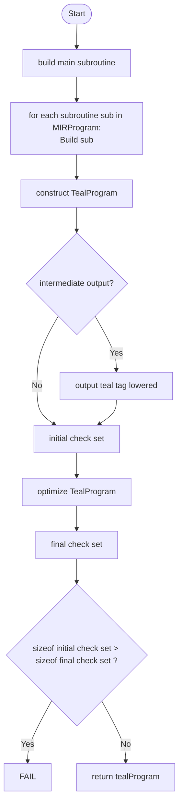

<!-- DRAFT -->

# TEAL layer (AVM code or "final" lowering)
<!-- TODO: intro -->
The TEAL layer is the code generation stage of the compiler pipeline. The output on this stage is valid [TEAL code](TODO_LINK_SPECS), which may be assembled into deployable bytecode by means of the [ussemble](assemble.md) stage, or by the `algod` assemble remote procedure, and executed in the Algorand Virtual Machine.\

In the following sections we will cover the process of constructing valid TEAL code from a `MIRProgram` (output by the previous stage).

# Lowering from MIR
The MIR program is consumed by `mir_to_teal(.)`, where the program's `main` subroutine is built first.
Then, each of the other subroutines are built.
> [Link to reference implementation](TODO_LINK)

Optionally, the TEAL at this intermediate, unoptimized stage is output, tagged as `"lowered"`.

Then optimizations are run on the lowered TEAL. Note that there are some optimizations here
that are run regardless of optimization level.

Finally the transformed full TEAL program is returned.

The [main algorithm](TODO_LINK) for this lowering does the following:

<!-- TODO: improve diagram syntax. Right now a placeholder -->

That is, the special `main` subroutine is built first, then each subroutine in the program.

A [`TealProgram`](#teal-layer-nodes) structure is created with these, with the corresponding avm version and program kind (whether a stateful application or a logic signature).

Explicit checks ([`Assert`](#teal-layer-nodes) and [`Err`](#teal-layer-nodes) instructions) are collected.\
[Optimizations](#optimizations-performed) are performed, and post-optimization explicit checks are collected again, and compared to those collected pre-optimization (see the [validations performed](#validations-performed) section below).\
Finally, the optimized TEAL program is output.

# Validations performed
In this layer, validations are incorporated and performed after certain key optimizing passes in order to ensure properties like stack consistency, or the survival of checks marked as _explicit_.

## Unexpected nodes during construction
<!-- TODO: fill these out -->

## Stack height validation (TEAL block level)
The block ops. are traversed in order. The condition checked is:\
$entry_stack_height + sum op.produces - op.consumes = exit_stack_height$, 
and also the series of partial sums obtained by sequentially subtracting `op.consumes` may never be less than zero (implying a stack underflow error was introduced by an optimization).

Note that blocks whose terminator are program/subroutine exit ops. (`return`, `retsub` and `err`) will discard all extra elements in stack and therefore constitute the only exceptions to the aforementioned condition.
> [Link to reference implementation](TODO_LINK)

## _Explicit check_ invariance
After lowering and before running optimization passes, an initial set of explicit checks is collected (see above in the build section). An explicit check is an `Assert` or `Err` TEAL model that has been marked as such from its start in the pipeline because it comes explicitly from the user code, and thus will have an internal flag set to `True` when built.
The collection algorithm simply tallies the amount of explicit checks by subroutine.\
After all [optimization passes](#optimizations-performed) are performed, explicit checks are collected again.
A decrease in explicit checks for a given subroutine means an optimization has been semantically destructive for the purpose of this validation, and will thus fail compilation.
> [!NOTE] the word _decrease_ hides a subtlety here; consider that ops may be duplicated on [inlining](#optimizations-performed), and thus there could be _more_ explicit checks after optimization than before.

# TEAL Layer nodes
The IR instructions in this layer are a quite close model of AVM TEAL ops, save for structural containers and template variables which are not part of AVM intrinsics.

Consider a stack, modelled as a list of local ids, which are strings that represent local variables.

We define 5 kinds of stack manipulations:
- `StackConsume`: takes `n` elements off the top of the stack.
- `StackExtend`: adds a sequence of local id's to the top of the stack.
- `StackDefine`: considering the set of unique variables in the stack, it performs a set intersection with the given elements, returning an extended set.
- `StackInsert`: inserts a local id at a given stack `depth`. For a given stack $s$, the insertion index is computed as $idx = |s| - depth$.
- `StackPop`: pops the stack at the specified `depth`. The index of the eliminated element is computed as $idx = |s| - depth - 1$

Note that in this layer, the nodes/models of the resulting language represent TEAL opcodes of the latest AVM version. An abstract opcode is modelled using the following fields:
(link to TealOp class)

- a string containing the opcode name
- a pair of unsigned integers representing the consumption and production of vals from stack

and optionally:
- a source location in code (see common reference)
- a comment to be emmitted after the op in the resulting TEAL
- an error message to be emmited when/if the program fails trying to execute this op
- a sequence of stack manipulations (...)

## `TealOp.` nodes

## `ControlOp.` nodes

# Appendix: output reading guide
At this stage, outputs are (optionally) produced in three parts:
- after initial lowering but before any code transformations are performed (tagged `lowered`)
- after peephole optimizations