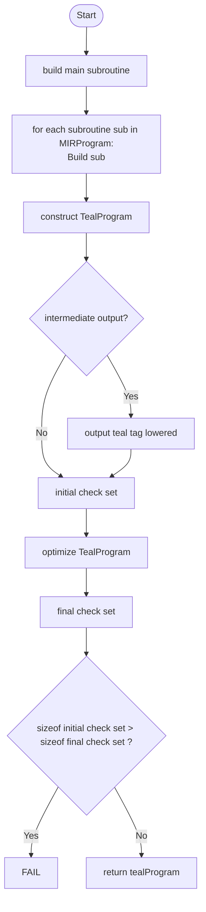

# TEAL layer (AVM code or "final" lowering)
<!-- TODO: intro -->
The TEAL layer is the code generation stage of the compiler pipeline. The output on this stage is valid [TEAL code](TODO_LINK_SPECS), which may be assembled into deployable bytecode by means of the [ussemble](assemble.md) stage, or by the `algod` assemble remote procedure, and executed in the Algorand Virtual Machine.\

In the following sections we will cover the process of constructing valid TEAL code from a `MIRProgram` (output by the previous stage).


# Lowering from MIR
The MIR program is consumed by `mir_to_teal(.)`, where the program's `main` subroutine is built first.
Then, each of the other subroutines are built.
> [Link to reference implementation](TODO_LINK)

Optionally, the TEAL at this intermediate, unoptimized stage is output, tagged as `"lowered"`.

Then optimizations are run on the lowered TEAL. Note that there are some optimizations here
that are run regardless of optimization level.

Finally the transformed full TEAL program is returned.

The [main algorithm](TODO_LINK) for this lowering does the following:

<!-- TODO: improve diagram syntax. Right now a placeholder -->

That is, the special `main` subroutine is built first, then each subroutine in the program.

A [`TealProgram`](#teal-layer-nodes) structure is created with these, with the corresponding avm version and program kind (whether a stateful application or a logic signature).

Explicit checks ([`Assert`](#teal-layer-nodes) and [`Err`](#teal-layer-nodes) instructions) are collected.\
[Optimizations](#optimizations-performed) are performed, and post-optimization explicit checks are collected again, and compared to those collected pre-optimization (see the [validations performed](#validations-performed) section below).\
Finally, the optimized TEAL program is output.

## Building
Most MIR nodes are lowered as a single TEAL node, which in turn almost always represent a single TEAL op.\
Notable exceptions to this rule are MIR `ConditionalBranch` nodes (which get lowered as 2 ops. to make the fallthrough case explicit), similarly to `Switch` and `Match` nodes.

> [!NOTE] after building, `TEALBlocks` are no longer assured to be strict basic blocks with a single exit point.
<!-- TODO: explain exceptions -->

<!-- Furthermore, as the `MIR` stage output is very close to a one to one mapping of TEAL code, many  -->

### `MIR.MemorySubroutine` to `TealSubroutine`
The main driver of the building process, this process is carried out for each subroutine in the `MIRProgram`.
In pseudocode, for a given `MemorySubroutine` `ms`:

<!-- TODO: finish pseudocode -->
```python
    TealSubroutine out
    if needsProto(ms):
        out.blocks = [protoBlock]
```
The first stage 


TODO: all other built models (any interesting parts)


### Conditional Branch
A [MIR conditional branch node](../specs/MIR.md) gets lowered as either a `BranchZero` TEAL node or a `BranchNotZero` TEAL node, followed by a `Branch` TEAL node targeting the next block.

> [!INFO] Right after building but before any optimizations, an output may be obtained. The output at this stage is tagged "lowered" (for example `my_contract.lowered.teal`), and is governed by the `--output-intermediate-teal` flag.

# Optimizations performed

<!-- TODO: DIAGRAMA_O0 -->

<!-- TODO: DIAGRAMA_O1 -->

<!-- TODO: DIAGRAMA_O2 -->

The main optimization loop (in [main.py](../puya/src/puya/teal/optimize/main.py)) executes
for each subroutine (inlcuding `main`), already lowered into TEAL after [MIR => TEAL lowering](MIR.md),
the following set of optimizations is performed in the order in which they are presented, dependant on optimization level.

## Subroutine optimizations at instruction level
These are mostly peephole optimizations performed at the instruction (op.) level. Several passes are realized until a stable program is achieved.

[Link to reference implementation](TODO_LINK)

These passes work at the [block level](#teal-block), which means they are run once for each block in the subroutine, replacing and simplifying ops. _inside_ a given block.

After every instruction level optimization pass through a block, a quick [stack height validation](#validations-performed) is performed for each block.

A loop is in place to perform [constant stack shuffling](#constant-stack-shuffling), [repeated rotations simplificacion](#repeated-rotations-simplification), and [peephole optimizations](#peephole-optimizations), in sequence.\
The loop works on the same block, tracking modifications through a boolean flag, and will stop once a full pass without modifications is completed.

### A comment on `StackManipulations`
Whenever a list of ops. (from now on, `_old_`) are to be replaced by a new optimized list (from now on, `_new_`), we have to keep track of the stack manipulations performed by the to-be-replaced ops. in `_old_`. If the new sequence of stack manipulations does not capture the same manipulations as the old stack, the stack manipulations in `_new_` will be erased for every op. and the stack manipulations in `_old_` will be put in place in a single op. of the `_new_` group, choosing said op. and appending or prepending according to the replacement rules explained below, to guarantee stack effects are preserved _on a block level_.

The replacement is carried in the following way:

- Consider a "window" into a list of instructions. This window is a slice of step 1, with a non-negative start and an end greater than its start, where the whole window fits inside said list of instructions (i.e. window end is less than or equal to the length of the ops. list).

- Furthermore, consider the lists `_old_` of ops. already in the block and `_new_` of changes proposed after a given optimization.

If `_new_` is not empty, stack manipulations will be added to the last op. in `_new_`.
If `_new_` is empty, this means we are attempting a full deletion of the ops. inside the given _window_.
Then, if there is at least one op. before the start of the _window_ in `_old_`, the stack manipulations will be _appended_ there.
Finally, if the window starts at the beginning, but there is at least an extra op. after it, `_old_` stack manipulations will be _prepended_ there.
> [!Note] if the window encompasses the full block, then the block itself should be deleted. This is handled separately somewhere else and should not happen here.

Also, note that stack manipulations are relevant at a full block context, not at an instruction by instruction context, so we can get away with collapsing sequences of stack manipulations into single ops. as long as the effects of the block as a whole are preserved.

For two given sets of stack manipulations, they are deemed equal if:
- they are equal element to element, or
- the result of their independant application _starting from an empty stack_ finishes (i.e. does not incur in an out-of-bounds error) and at the end, both stacks (with order) are in the same state, and the sets of definitions performed are equal.\
Note here that a failure to apply manipulations by going out of bounds means the stacks are deemed unequal even if their application in some non-empty stack could yield the same results.
<!-- TODO: example of valid window -->
> [Link to reference implementation](TODO_LINK)

### Constant stack shuffling
Consider now for a given block, the list of instructions that, without modifying the stack prior, add a (constant) element on top of the stack (meaning, an element that does not depend on the shape or values in the stack prior for the value that it produces; constant in terms of the stack).\
We traverse the list of ops. in the block $b$, keeping a list of "constant loads" (ops included in the "load list") which we'll call the "load sub-stack" for the purpose of this optimization.

The general concept is to traverse a given `TealBlock`s sequence of instructions in sequential order, greedily building a sub-stack of sequential "constant loads", performing the necessary transformations (and stack preserving accordingly) when encountring instances of stack manipulation in the form of `dup`, `dupn`, `cover` and `uncover`; and closing the sub-stack tally and replacing the instructions in the block whenever an op. not in the relevant group ("constant load" &\cup$ `{dup, dupn, cover, uncover}`) is found (after which a new tally is open if instructions have not been visited yet, and the pattern continues).

If on an ongoing list of consecutive loads, we find a `Dup` or `Dupn` op. (modelled as an `Intrinsic` whose opcode string is a `dup` or `dupn`. See the full model section for more information), we extend the repeated loads to add 1 or `n` (respectively) repetitions of the last load in the sub-stack. We append the stack manipulations present in this duplication op. to the last load operation in the newly generated copies.

If we have an ongoing list of consecutive loads, and we run into a `Cover` or `Uncover` op, and this op. is modifying the current sub-stack of loads (its immediate is such that it is less than the length of this ad-hoc constructed sub-stack), we modify the loads list accordingly (popping and pushing the uncovered value, or popping the last load and inserting it into the appropriate place for a covered value).

Finally, if the op found is not a "load", not a `Cover` or`Uncover`, and not a `Dup` or `Dupn`, we have a stack of constant loads with its transformations.
We attempt to   X    while preserving stack manipulations of the group as a whole.
We then continue iterating and assembling a new sub-stack of loads from where we left.

<!-- TODO: example -->

### Repeated rotations simplification


### Peephole optimizations
These are optimizations that replace teal patterns for other, more budget-efficient or bytecode-succint patterns.

There are windows of one, two, three and four opcodes respectively that will be used.
They will appear sequentially in order of window size.

Some preliminary definitions:
- `{COMM_OP}` is a commutative op. One of 
`[
        "+",
        "*",
        "&",
        "&&",
        "|",
        "||",
        "^",
        "==",
        "!=",
        "b*",
        "b+",
        "b&",
        "b|",
        "b^",
        "b==",
        "b!=",
        "addw",
        "mulw"
]`
- `{SWAP_OP}` is a stack swap op. One of 
`[
        "swap",
        "cover 1",
        "uncover 1"
]`

By size of the peephole window defined, we have the following optimizations performed.

### Singles:
Note that all of these are performed at all opt. levels (even -O0).
- `arg n` -> `arg_n` (for `n <= 3`).
- `cover 0` -> []. Also `uncover 0` -> [].
- `dig 0` -> `dup`.
- `popn 1` -> `pop`.

### Pairs:
Note that all of these are performed even at -O0.
- Redundant rotation removal. This encompasses:
        1) `cover n; uncover n;` -> []. 
        2) `uncover n; cover n;` -> [].
        3) `swap; swap;` -> [].
        4) `swap; cover 1;` -> [].
        5) `swap; uncover 1;` -> [].
        6) `cover 1; swap;` -> [].
        7) `cover 1; cover 1;` -> [].
        8) `cover 1; uncover 1;` -> []. (already transformed in 1st rule).
        9) `uncover 1; swap;` -> [].
        10) `uncover 1; cover 1;` -> []. (already transformed in 1st rule).
        11) `uncover 1; uncover 1;` -> [].
- Any stack swap followed by a `pop` is replaced by a `bury 1`:
        1) `swap; pop` -> `bury 1`.
        2) `cover 1; pop` -> `bury 1`.
        3) `uncover 1; pop` -> `bury 1`.
- Any stack swap followed by a commutative op is replaced by just the op by itself. Like this:
`{SWAP_OP}; {COMM_OP}` -> `{COMM_OP}`.
- `frame_dig n; frame_bury n` -> [].
- `frame_bury n; frame_dig n` -> `dup; frame_bury_n;`.
- `dup; {SWAP_OP}` -> `dup`. Also `dupn; {SWAP_OP}` -> `dupn`.
- `dup; pop` -> [].
(TODO: complete!)

- `dig 1; dig 1` -> `dup2`.
- `int 0; return -> err`.
- Any stack swap operations followed by binary ordering operations are reversed. Like this:
`{SWAP_OP}; {BIN_ORD_OP}` -> `{flip(BIN_ORD_OP)}`, where `flip()` finds usage of `>` or `<` and
inverts them (e.g. `>=` becomes `<=`).


### Triplets:
If any of the ops in the analysis triplet is a `frame_dig` operation, a special analysis is performed. 
<!-- TODO explain frame_dig analysis and why its relevant-->
- `'cover 3; cover 3; {SWAP_OP}` -> `uncover 2; uncover 3`
Proof: ...

- `uncover 2; {SWAP_OP}; uncover 2` -> `swap`
Proof: ...

TODO: complete

### Quadruplets:
TODO

> [!INFO] after the set of [op. level optimizations](#subroutine-op-optimizations) is run, an optional intermediate output may be emitted, with the qualifier _"peephole"_ (e.g. `my_contract.peephole.teal`).

## Constant `dupn` and `dup2` insertion
> [!NOTE] this pair of optimizations is only run in `O1` and `O2` levels

## Repeated rotation ops. search
> [!NOTE] this optimization is only run in the `O2` level


## Swap operations simplification
> [!NOTE] this optimization is only run in `O1` and `O2` levels
During traversal of the list of ops. in a block, we specifically look for `Cover` or `Uncover` instructions where the immediate is 1. This pattern is equivalent to a `Swap` operation, which has no immediates. Therefore we can reduce bytecode by replacing the original pattern for a `Swap` (preserving any stack manipulations attached to the original operation).

Example:
```
uncover 1
+
push 1
cover 1
```
is replaced by
```
swap
+
push 1
swap
```


## Subroutine Block optimizations
> [!INFO] this set of optimizations is only performed on optimization levels `O1` and `O2`.

Most of the subroutines in this pass deal with getting rid of jumps by inlining when possible. We simplify chains of single unconditional jump instruction blocks,...
TODO: complete intro


### Inline optimizations: jump chains
Consider now the set of all blocks $b$ that are a single unconditional `Branch` to a target, have no stack manipulations associated, and are not the entry block.\

We remove these from the subroutine blocks, keeping track of the link between original block label and their target.

Now, for every jump chain $b_0 => b_1 => ... => b_n$, we backpropagate in order to have every $b_0, b_1...b_{n-1} => b_n$, mapping their unique identifying labels to the last on the chain.

After we have simplified all possible chains, we traverse all instructions inside the subroutine. For every jump instruction (`Branch`, `BranchNonZero`, `BranchZero`, `Switch` and `Match`) targetting any element in a chain, we replace the target by the last element.


### Inline optimizations: single instruction blocks
TODO: complete

### Inline optimizations: singly referenced blocks
TODO: complete

### Replacement of subroutine invocations for branches
For a given subroutine, we iterate over all instructions. If a given `callsub` op. is found, and the jump target subroutine is determined to be "branchable" (see above for the definition), the operation is replaced by a hard branch (`b`, represented in this layer by the [`Branch`](#TODO_branch) node) to the same jump target.


### Inline jump chains
TODO: this one is repeated, but is the same as above. Should we keep it here?


### Remove jump fallthroughs
As per the building process, [MIR Conditionals](#TODO_LINK_MIR), as well as [Match] and [Switch] MIR nodes, generate explicit fallthrough hard branches (`b`, represented as `Branch` in this layer). These fallthroughs are useful for some analysis, but have no impact in control flow as the natural opcode evaluation order would trivially flow into the next line. Therefore, they are trivially removable at this stage.\
Consider every pair of consecutive blocks $b0, b1$. whenever the last instruction in $b0$ is a `Branch` (unconditional branch) and the jump target is the unique identifying label of $b1$, we remove the branch operation from $b0$. 

TODO: what happens if I have an explicit branch to the label right next to it? Should we protect against this by making sure the branch is a fallthrough (e.g. check that the instruction right before is a bz or bnz)?

TODO: understand stack manipulations guard case for O0


## Constant gathering
> [!INFO] this optimization is performed on all optimization levels (`O0`, `O1` and `O2`).

> [!NOTE] this optimization is needed in `O0` because, due to ARC56, template variables need to be gathered into constant blocks for pc offset calculations. See the [ARC56 standard](TODO_LINK) for further details.


## Combine pushes

> [!INFO] this is only done for optimization levels `O1` and `O2`.

If there is any sequence of consecutive `pushint` or `pushbytes` operations present in any block, in any subroutine, 
they are compressed into a `pushints` or `pushbytess` respectively. In the case of `pushbytess`, byte encodings are preserved for each value. Comments are comma-concatenated accordingly.
TODO: example


<!-- def optimize_teal_program(
    context: ArtifactCompileContext, teal_program: models.TealProgram
) -> None:
    # O0 will still remove some redundant ops to ensure a feasible program size
    for teal_sub in teal_program.all_subroutines:
        _optimize_subroutine_ops(context, teal_sub)
    maybe_output_intermediate_teal(context, teal_program, qualifier="peephole")

    if context.options.optimization_level > 0:
        branchable_subroutine_entry_blocks = {
            sub.blocks[0].label
            for sub in teal_program.all_subroutines
            if _is_branchable_subroutine(sub)
        }

        for teal_sub in teal_program.all_subroutines:
            _optimize_subroutine_blocks(context, teal_sub, branchable_subroutine_entry_blocks)
        maybe_output_intermediate_teal(context, teal_program, qualifier="block")

    gather_program_constants(teal_program)
    if context.options.optimization_level > 0:
        combine_pushes(teal_program) -->


# Validations performed
In this layer, validations are incorporated and performed after certain key optimizing passes in order to ensure properties like stack consistency, or the survival of checks marked as _explicit_.

## Unexpected nodes during construction
<!-- TODO: fill these out -->

## Stack height validation (TEAL block level)
The block ops. are traversed in order. The condition checked is:\
$entry_stack_height + sum op.produces - op.consumes = exit_stack_height$, 
and also the series of partial sums obtained by sequentially subtracting `op.consumes` may never be less than zero (implying a stack underflow error was introduced by an optimization).

Note that blocks whose terminator are program/subroutine exit ops. (`return`, `retsub` and `err`) will discard all extra elements in stack and therefore constitute the only exceptions to the aforementioned condition.
> [Link to reference implementation](TODO_LINK)


## _Explicit check_ invariance
After lowering and before running optimization passes, an initial set of explicit checks is collected (see above in the build section). An explicit check is an `Assert` or `Err` TEAL model that has been marked as such from its start in the pipeline because it comes explicitly from the user code, and thus will have an internal flag set to `True` when built.
The collection algorithm simply tallies the amount of explicit checks by subroutine.\
After all [optimization passes](#optimizations-performed) are performed, explicit checks are collected again.
A decrease in explicit checks for a given subroutine means an optimization has been semantically destructive for the purpose of this validation, and will thus fail compilation.
> [!NOTE] the word _decrease_ hides a subtlety here; consider that ops may be duplicated on [inlining](#optimizations-performed), and thus there could be _more_ explicit checks after optimization than before.


# TEAL Layer nodes
The IR instructions in this layer are a quite close model of AVM TEAL ops, save for structural containers and template variables which are not part of AVM intrinsics.

Consider a stack, modelled as a list of local ids, which are strings that represent local variables.

We define 5 kinds of stack manipulations:
- `StackConsume`: takes `n` elements off the top of the stack.
- `StackExtend`: adds a sequence of local id's to the top of the stack.
- `StackDefine`: considering the set of unique variables in the stack, it performs a set intersection with the given elements, returning an extended set.
- `StackInsert`: inserts a local id at a given stack `depth`. For a given stack $s$, the insertion index is computed as $idx = |s| - depth$.
- `StackPop`: pops the stack at the specified `depth`. The index of the eliminated element is computed as $idx = |s| - depth - 1$


Note that in this layer, the nodes/models of the resulting language represent TEAL opcodes of the latest AVM version. An abstract opcode is modelled using the following fields:
(link to TealOp class)

- a string containing the opcode name
- a pair of unsigned integers representing the consumption and production of vals from stack

and optionally:
- a source location in code (see common reference)
- a comment to be emmitted after the op in the resulting TEAL
- an error message to be emmited when/if the program fails trying to execute this op
- a sequence of stack manipulations (...)

## `TealOp.` nodes

## `ControlOp.` nodes


# Appendix: output reading guide
At this stage, outputs are (optionally) produced in three parts:
- after initial lowering but before any code transformations are performed (tagged `lowered`)
- after peephole optimizations