<!-- DRAFT -->

# AWST Node reference

The following section covers every single node expressable in the AWST.\
For each, we also give its representation in the `awst` human readable output file, as well as any specific field validations performed.

Here is a diagram of the full `AWST` class hierarchy. Note that leaf nodes are the concrete code constructs, and parent nodes are the overarching language construct categories (e.g. expressions, statements, functions and root level scoped elements).

```mermaid
classDiagram
direction TB

class Node
class Statement
class Expression
class RootNode
class Function
class ContractMemberNode

Node --|> Statement
Node --|> Expression
Node --|> RootNode
Node --|> ContractMemberNode

Statement --|> ExpressionStatement
Statement --|> Block
Statement --|> Goto
Statement --|> IfElse
Statement --|> Switch
Statement --|> WhileLoop
Statement --|> LoopExit
Statement --|> LoopContinue
Statement --|> ReturnStatement
Statement --|> ForInLoop
Statement --|> UInt64AugmentedAssignment
Statement --|> BigUIntAugmentedAssignment
Statement --|> BytesAugmentedAssignment
Statement --|> AssignmentStatement

Expression --|> AssertExpression
Expression --|> IntegerConstant
Expression --|> DecimalConstant
Expression --|> BoolConstant
Expression --|> BytesConstant
Expression --|> StringConstant
Expression --|> VoidConstant
Expression --|> TemplateVar
Expression --|> MethodConstant
Expression --|> AddressConstant
Expression --|> ARC4Encode
Expression --|> ARC4Decode
Expression --|> ARC4FromBytes
Expression --|> ConvertArray
Expression --|> Copy
Expression --|> ArrayConcat
Expression --|> ArrayExtend
Expression --|> ArrayPop
Expression --|> ArrayReplace
Expression --|> SizeOf
Expression --|> IntrinsicCall
Expression --|> CreateInnerTransaction
Expression --|> UpdateInnerTransaction
Expression --|> StageInnerTransactions
Expression --|> GroupTransactionReference
Expression --|> CheckedMaybe
Expression --|> TupleExpression
Expression --|> TupleItemExpression
Expression --|> NamedTupleExpression
Expression --|> VarExpression
Expression --|> InnerTransactionField
Expression --|> SetInnerTransactionFields
Expression --|> SubmitInnerTransaction
Expression --|> FieldExpression
Expression --|> IndexExpression
Expression --|> SliceExpression
Expression --|> IntersectionSliceExpression
Expression --|> AppStateExpression
Expression --|> AppAccountStateExpression
Expression --|> BoxPrefixedKeyExpression
Expression --|> BoxValueExpression
Expression --|> SingleEvaluation
Expression --|> ReinterpretCast
Expression --|> NewArray
Expression --|> ArrayLength
Expression --|> ConditionalExpression
Expression --|> AssignmentExpression
Expression --|> CommaExpression
Expression --|> NumericComparisonExpression
Expression --|> BytesComparisonExpression
Expression --|> SubroutineCallExpression
Expression --|> ABICall
Expression --|> PuyaLibCall
Expression --|> UInt64UnaryOperation
Expression --|> UInt64PostfixUnaryOperation
Expression --|> BigUIntPostfixUnaryOperation
Expression --|> BytesUnaryOperation
Expression --|> UInt64BinaryOperation
Expression --|> BigUIntBinaryOperation
Expression --|> BytesBinaryOperation
Expression --|> BooleanBinaryOperation
Expression --|> Not
Expression --|> Emit
Expression --|> Range
Expression --|> Enumeration
Expression --|> Reversed
Expression --|> StateGet
Expression --|> StateGetEx
Expression --|> StateExists
Expression --|> StateDelete
Expression --|> NewStruct
Expression --|> CompiledContract
Expression --|> CompiledLogicSig
Expression --|> ARC4Router

Function --|> Subroutine
Function --|> ContractMethod

RootNode --|> Subroutine
RootNode --|> LogicSignature
RootNode --|> Contract

ContractMemberNode --|> ContractMethod
ContractMemberNode --|> AppStorageDefinition
```

<!--  -->

## Base

- `Node`
- `Statement` – base class for all statement nodes
- `Expression` – base class for all expression nodes
- `RootNode` – base class for top-level compilation units
- `Function` – base class for subroutines / methods
- `ContractMemberNode` – base class for contract-scoped members

---

## Statement Nodes

- `ExpressionStatement`
- `Block`
- `Goto`
- `IfElse`
- `Switch`
- `WhileLoop`
- `LoopExit`
- `LoopContinue`
- `ReturnStatement`
- `AssignmentStatement`
- `UInt64AugmentedAssignment`
- `BigUIntAugmentedAssignment`
- `BytesAugmentedAssignment`
- `ForInLoop`

---

## Literal / Constant Expression Nodes

- `AssertExpression`
- `IntegerConstant`
- `DecimalConstant`
- `BoolConstant`
- `BytesConstant`
- `StringConstant`
- `VoidConstant`
- `TemplateVar`
- `MethodConstant`
- `AddressConstant`

(Plus alias type: `CompileTimeConstantExpression`)

---

## ARC4 Encoding / Conversion Expressions

- `ARC4Encode`
- `ARC4Decode`
- `ARC4FromBytes`
- `ConvertArray`
- `NewArray`
- `NewStruct`
- `ARC4Router`

---

## Array / Tuple / Struct Expressions

- `Copy`
- `ArrayConcat`
- `ArrayExtend`
- `ArrayPop`
- `ArrayReplace`
- `ArrayLength`
- `TupleExpression`
- `TupleItemExpression`
- `NamedTupleExpression`
- `FieldExpression`
- `IndexExpression`
- `SliceExpression`
- `IntersectionSliceExpression`

---

## Storage & State Expressions

- `AppStateExpression`
- `AppAccountStateExpression`
- `BoxPrefixedKeyExpression`
- `BoxValueExpression`
- `StorageExpression` (alias:
  `AppStateExpression | AppAccountStateExpression | BoxValueExpression`)
- `StateGet`
- `StateGetEx`
- `StateExists`
- `StateDelete`

---

## Inner-Transaction Expressions

- `CreateInnerTransaction`
- `UpdateInnerTransaction`
- `SetInnerTransactionFields`
- `SubmitInnerTransaction`
- `InnerTransactionField`
- `GroupTransactionReference`

---

## Misc Core Expressions

- `SizeOf`
- `IntrinsicCall`
- `VarExpression`
- `CheckedMaybe`
- `SingleEvaluation`
- `ReinterpretCast`
- `ConditionalExpression`
- `AssignmentExpression`
- `CommaExpression`
- `Emit`
- `Range`
- `Enumeration`
- `Reversed`
- `StateGet`
- `StateGetEx`
- `StateExists`
- `StateDelete`
- `CompiledContract`
- `CompiledLogicSig`

---

## Comparison Expressions

- `NumericComparisonExpression`
- `BytesComparisonExpression`
- `BooleanBinaryOperation`
- `Not`

---

## Integer / Bytes Unary & Binary Expressions

- `UInt64UnaryOperation`
- `UInt64PostfixUnaryOperation`
- `BigUIntPostfixUnaryOperation`
- `BytesUnaryOperation`
- `UInt64BinaryOperation`
- `BigUIntBinaryOperation`
- `BytesBinaryOperation`

---

## Call / Library Expressions

- `SubroutineCallExpression`
- `PuyaLibCall`

---

## Subroutines & Contracts (Root Nodes)

- `Subroutine` (implements `Function`, `RootNode`)
- `ContractMethod` (implements `Function`, `ContractMemberNode`)
- `AppStorageDefinition` (implements `ContractMemberNode`)
- `LogicSignature` (implements `RootNode`)
- `Contract` (implements `RootNode`)