# Full models reference

The following diagram shows the full model class hierarchy, grouping concrete nodes by their abstract parent classes.

```mermaid
classDiagram
direction TB

class Context {
  <<protocol>>
  +source_location: SourceLocation | None
}

class IRVisitable {
  <<abstract>>
  +accept(visitor: IRVisitor[T]) T
}

class _Freezable {
  <<abstract>>
  +freeze() object
  #_frozen_data() object
}

IRVisitable ..|> Context
IRVisitable ..|> _Freezable

class ValueProvider {
  <<abstract>>
  +source_location: SourceLocation | None
  +types: Sequence[IRType]
}
ValueProvider --|> IRVisitable

class Value {
  <<abstract>>
  +ir_type: IRType
  +atype: AVMType (uint64|bytes)
  +types: Sequence[IRType]
}
Value --|> ValueProvider

class Constant {
  <<abstract>>
}
Constant --|> Value

class Undefined
Undefined --|> Value

class Register {
  +name: str
  +version: int
  +local_id: str
}
Register --|> Value

class Parameter {
  +implicit_return: bool
}
Parameter --|> Register

class TemplateVar {
  +name: str
  +ir_type: IRType
}
TemplateVar --|> Value

class UInt64Constant {
  +value: int
  +teal_alias: str | None
  +ir_type: IRType
}
UInt64Constant --|> Constant

class ITxnConstant {
  +value: int
  +ir_type: IRType
}
ITxnConstant --|> Constant

class SlotConstant {
  +value: int
  +ir_type: SlotType
}
SlotConstant --|> Constant

class BigUIntConstant {
  +value: int
  +ir_type: IRType
}
BigUIntConstant --|> Constant

class BytesConstant {
  +value: bytes
  +encoding: AVMBytesEncoding
  +ir_type: IRType
}
BytesConstant --|> Constant

class AddressConstant {
  +value: str
  +ir_type: IRType
}
AddressConstant --|> Constant

class MethodConstant {
  +value: str
  +ir_type: IRType
}
MethodConstant --|> Constant

class CompiledContractReference {
  +artifact: ContractReference
  +field: TxnField
  +template_variables: Mapping[str, Value]
  +program_page: int | None
}
CompiledContractReference --|> Value

class CompiledLogicSigReference {
  +artifact: LogicSigReference
  +template_variables: Mapping[str, Value]
}
CompiledLogicSigReference --|> Value

class Op {
  <<abstract>>
}
Op --|> IRVisitable

class ControlOp {
  <<abstract>>
  +source_location: SourceLocation | None
  +targets() Sequence[BasicBlock]
  +unique_targets: list[BasicBlock]
  +replace_target(find: BasicBlock, replace: BasicBlock)
}
ControlOp --|> IRVisitable

class PhiArgument {
  +value: Register
  +through: BasicBlock
}
PhiArgument --|> IRVisitable

class Phi {
  +register: Register
  +args: list[PhiArgument]
}
Phi --|> IRVisitable

class Intrinsic {
  +op: AVMOp
  +immediates: list[str|int]
  +args: list[Value]
  +error_message: str | None
  +types: Sequence[IRType]
}
Intrinsic --|> Op
Intrinsic --|> ValueProvider

class InvokeSubroutine {
  +target: Subroutine
  +args: list[Value]
  +types: Sequence[IRType]
}
InvokeSubroutine --|> Op
InvokeSubroutine --|> ValueProvider

class ValueTuple {
  +values: list[Value]
  +ir_type: TupleIRType
  +types: Sequence[IRType]
}
ValueTuple --|> ValueProvider

class Assignment {
  +targets: list[Register]
  +source: ValueProvider
  +source_location: SourceLocation | None
}
Assignment --|> Op

class InnerTransactionField {
  +field: str
  +group_index: Value
  +is_last_in_group: Value
  +array_index: Value | None
  +type: IRType
}
InnerTransactionField --|> ValueProvider

class ArrayLength {
  +base: Value
  +base_type: IRType
  +array_encoding: ArrayEncoding
}
ArrayLength --|> ValueProvider

class _Aggregate {
  <<abstract>>
  +base: Value
  +base_type: EncodedType
  +indexes: tuple[int|Value, ...]
}
_Aggregate --|> ValueProvider

class ExtractValue {
  +check_bounds: bool
  +ir_type: IRType
}
ExtractValue --|> _Aggregate

class ReplaceValue {
  +value: Value
  +types: Sequence[IRType]
}
ReplaceValue --|> _Aggregate

class BoxRead {
  +key: Value
  +value_type: IRType
  +exists_assertion_message: str
}
BoxRead --|> ValueProvider

class BoxWrite {
  +key: Value
  +value: Value
  +delete_first: bool
  +source_location: SourceLocation | None
}
BoxWrite --|> Op

class BytesEncode {
  +encoding: Encoding
  +values: list[Value]
  +values_type: IRType|TupleIRType
  +error_message_override: str | None
}
BytesEncode --|> ValueProvider

class DecodeBytes {
  +encoding: Encoding
  +value: Value
  +ir_type: IRType|TupleIRType
  +error_message_override: str | None
}
DecodeBytes --|> ValueProvider

class NewSlot {
  +ir_type: SlotType
}
NewSlot --|> ValueProvider

class ReadSlot {
  +slot: Value  %% (validated SlotType)
}
ReadSlot --|> ValueProvider

class WriteSlot {
  +slot: Value  %% (validated SlotType)
  +value: Value
  +source_location: SourceLocation | None
}
WriteSlot --|> Op

class Assert {
  +condition: Value
  +message: str | None
  +explicit: bool
  +source_location: SourceLocation | None
}
Assert --|> Op

class BasicBlock {
  +source_location: SourceLocation
  +phis: list[Phi]
  +ops: list[Op]
  +terminator: ControlOp | None
  +id: int | None
  +label: str | None
  +comment: str | None
}
BasicBlock ..|> Context

class ConditionalBranch {
  +condition: Value
  +non_zero: BasicBlock
  +zero: BasicBlock
}
ConditionalBranch --|> ControlOp

class Goto {
  +target: BasicBlock
}
Goto --|> ControlOp

class GotoNth {
  +value: Value
  +blocks: list[BasicBlock]
  +default: BasicBlock
}
GotoNth --|> ControlOp

class Switch {
  +value: Value
  +cases: dict[Value, BasicBlock]
  +default: BasicBlock
}
Switch --|> ControlOp

class SubroutineReturn {
  +result: list[Value]
}
SubroutineReturn --|> ControlOp

class ProgramExit {
  +result: Value
}
ProgramExit --|> ControlOp

class Fail {
  +error_message: str | None
  +explicit: bool
}
Fail --|> ControlOp

class Subroutine {
  +id: str
  +short_name: str
  +source_location: SourceLocation | None
  +parameters: Sequence[Parameter]
  +_returns: Sequence[IRType]
  +body: list[BasicBlock]
  +inline: bool | None
  +is_routing_wrapper: bool
  +pure: bool
}
Subroutine ..|> Context

class Program {
  +kind: ProgramKind
  +main: Subroutine
  +subroutines: Sequence[Subroutine]
  +avm_version: int
  +slot_allocation: SlotAllocation
  +source_location: SourceLocation | None
}
Program ..|> Context

class Contract {
  +source_location: SourceLocation
  +approval_program: Program
  +clear_program: Program
  +metadata: ContractMetaData
}
Contract ..|> Context

class LogicSignature {
  +source_location: SourceLocation
  +program: Program
  +metadata: LogicSignatureMetaData
}
LogicSignature ..|> Context

class ModuleArtifact {
  <<union>>
  Contract | LogicSignature
}

class SlotAllocationStrategy {
  <<enumeration>>
  none
  dynamic
}

class SlotAllocation {
  +reserved: Set[int]
  +strategy: SlotAllocationStrategy
}

%% Useful type alias (not a class in runtime)
class MultiValue {
  <<type alias>>
  Value | ValueTuple
}
```

## `Phi`
> [Link to reference implementation](TODO_LINK)