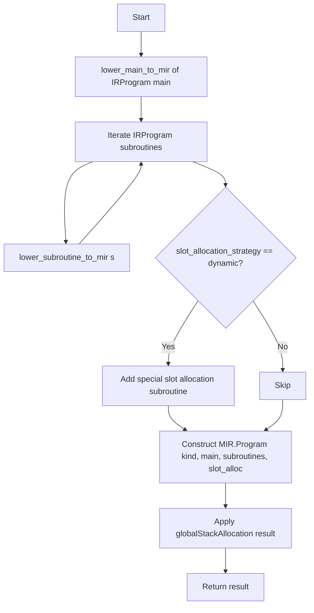

<!-- DRAFT -->

# Memory Intermediate Representation (MIR) layer

Up to this point, all allocations are _abstract_ (see the [relevant nodes in IR](IR.md#full-models-reference)) (not counting allocations explicitly defined by the user TODO: example).
In this layer, these _abstract_ allocations are made concrete by simulation and analysis of stack usage. 
<!-- In order to make the best possible usage of the native AVM stack [TODO: LINK to research] is used. -->

The general idea of this layer is the introduction of 3 logical stack regions, according to their relation to the overall control flow structure of the program.

The `l-stack` is, conceptually, the stack region used for intra-block allocations.\
The `x-stack` is the stack region used for inter-block allocations.\
Finally, the `f-stack` is used for the frame region ([explicit in the AVM](TODO_link_to_specs_AVM_section)). It is created in the entry block for each subroutine and maintained constant throughout the rest of basic blocks.

The following document attempts an exhaustive explanation of lowering from IR to MIR, stack allocation building, optimizations and validations performed at this step up to the output representation, that will be the input of the following [TEAL](TEAL.md) layer.
<!-- Having this region preserved in the stack is useful for most allocations that don't fit any of the other two regions.
TODO: improve explanation of f-stack -->

# MIR main algorithm

The following diagram shows the MIR pipeline schematically.

> Link to reference implementation [here](TODO_LINK).

In the [building phase](#ir--mir-lowering), each subroutine in the IR [`Program`](IR.md#full-models-reference) input is lowered, starting with main as a special case.\
Then each non-main subroutine is built.\
At the end of the building process, and only in the case of a `dynamic slot allocation strategy`, we build the slot allocation and append a special slot building subroutine at the end of the subroutine list.

Finally, the [`global stack allocation`](./MIR-building/MIR-building.md#global-stack-allocation) algorithm is performed, constructing each stack region according to the required optimization level, and materialising all `AbstractLoad` and `AbstractStore` operations in the process.

After this, we get the final output ready to continue down the pipeline to the [TEAL](TEAL.md) stage.